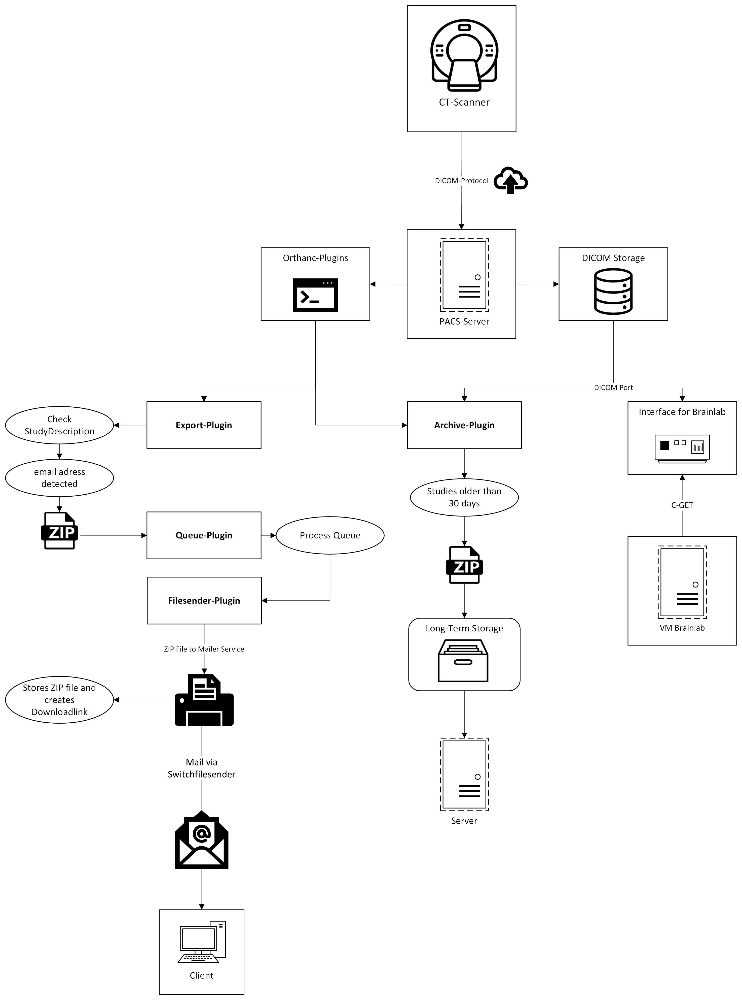
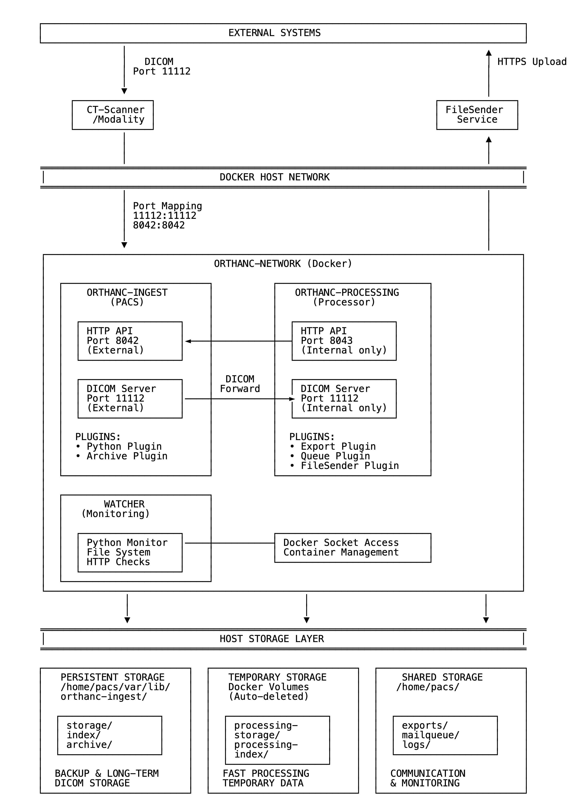

# Orthanc DICOM Mailer System

An automated DICOM archiving and distribution system for Swiss universities, integrating Orthanc DICOM Server with SWITCH FileSender for secure medical image sharing.



## Overview

This system automatically processes DICOM studies uploaded to Orthanc, extracts recipient information from study metadata, creates encrypted archives, and securely distributes them via SWITCH FileSender  (Switzerland's academic file sharing service.)

## Key Features

- **Automated DICOM Processing**: Processes incoming medical images automatically
- **Secure Distribution**: Uses SWITCH FileSender for encrypted file transfers up to 50GB
- **Email-Based Workflow**: Recipients specified directly in DICOM StudyDescription
- **Password Protection**: Creates encrypted ZIP archives with custom passwords
- **Automatic Archiving**: Archives old studies to free up storage space
- **Docker-Based**: Complete containerized deployment
- **One-Click Setup**: Simple config with deploy.env.sh


## Systemarchitecture



- **orthanc-ingest:** DICOM-Empfang, PACS-Funktionalität, langfristige Archivierung
- **orthanc-processing:** Temporäre Verarbeitung, Export, Versand, automatische Metadaten-Bereinigung

## Workflow

1. **DICOM Upload**: Medical images are uploaded to Orthanc DICOM server
2. **Automatic Detection**: ExportPlugin detects studies with email addresses in StudyDescription
3. **Archive Creation**: System creates encrypted ZIP archive with password protection
4. **Queue Processing**: QueuePlugin moves files to processing queue
5. **Secure Upload**: FilesenderPlugin uploads via SWITCH FileSender
6. **Email Notification**: Recipients receive download links via email
7. **Automatic Cleanup**: Old studies are archived and removed to free space

## StudyDescription Format

Include recipient information directly in the DICOM StudyDescription field:

```
Study Name recipient@example.com pw=secure123
```

**Format:**
- `recipient@example.com`: Email address of the recipient
- `pw=secure123`: Password for the encrypted ZIP file
- Remaining text becomes the cleaned study description

## Quick Start

### Prerequisites

- Linux server with Docker and Docker Compose
- Git access to the repository
- SWITCH FileSender account (for Swiss universities)

### Installation

1. **Clone and Configure**
   ```bash
   git clone <repository-url>
   cd orthanc-mailer
   cp deploy-config.sh.example deploy-config.sh
   ```

2. **Edit Configuration**
   ```bash
   nano deploy-config.sh
   ```

   Configure your settings:
   ```bash
   export HOME_DIR="location_of_deployment"
   export REPO="git@github.com:Emre-Yasar-RT/Orthanc_mailer.git"
   export SERVER_HOSTNAME="your-server.domain.ch"
   export HTTP_PORT="80"
   export DICOM_PORT="11112"
   
   # SWITCH FileSender credentials
   export FILESENDER_USERNAME="your.email@university.ch"
   export FILESENDER_API_KEY="your-api-key-from-switch"
   
   # DICOM modalities (your imaging devices)
   export DICOM_MODALITY_1_NAME="MRI-Scanner"
   export DICOM_MODALITY_1_AET="MRI1"
   export DICOM_MODALITY_1_HOST="192.168.1.100"
   export DICOM_MODALITY_1_PORT="11112"
   ```

3. **Deploy**
   ```bash
   chmod +x deploy-config.sh
   ./deploy-config.sh
   ```

That's it! The system will:
- Install all dependencies
- Build custom plugins
- Start Orthanc with Docker
- Configure automatic monitoring
- Set up log management

### Access

- **Orthanc Web Interface**: `http://your-server:8042`
- **DICOM Port**: `11112` (configure in your modalities)
- **Logs**: `~/logs/` directory structure

## System Components

### Core Services

- **Orthanc DICOM Server**: Medical image storage and management
- **PostgreSQL**: Database backend (optional, SQLite default)
- **Custom Plugins**: Automated processing pipeline

### Custom Plugins

#### ExportPlugin v2.1
- Monitors incoming DICOM studies
- Extracts email addresses and passwords from StudyDescription
- Creates encrypted ZIP archives with patient data
- Handles race conditions and ensures data integrity

#### QueuePlugin v2.1  
- Manages file transfer queue
- Atomic file operations to prevent corruption
- REST API endpoint: `POST /send`

#### FilesenderPlugin v2.2
- Watches queue directory for new files
- Uploads files via SWITCH FileSender API
- Handles retry logic and error recovery
- Synchronous uploads with timeout handling

### Automation Scripts

- **archive.py**: Automatic archiving of old studies
- **log_monitor.sh**: System monitoring and log management
- **cronjob.sh**: Scheduled maintenance tasks

## Configuration Details

### DICOM Settings

```bash
export DICOM_AET="ORTHANC"           # Your AET title
export DICOM_PORT="11112"            # DICOM communication port
export ARCHIVE_AGE_DAYS="30"         # Days before archiving studies
```

### SWITCH FileSender API Setup

Before configuring the system, you need to create an API key:

1. **Access SWITCH FileSender**: Go to https://filesender.switch.ch/filesender2/?s=user
2. **Login**: Use your university SWITCH account credentials
3. **Create API Secret**: Navigate to the API section and generate a new secret key
4. **Copy Credentials**: Note down your username and the generated API key

Configure these in your deployment:
```bash
export FILESENDER_USERNAME="firstname.lastname@university.ch"
export FILESENDER_API_KEY="your-64-character-api-key"
```

**Note**: You need a valid SWITCH account from a Swiss university to access this service.

### Modalities Configuration

Configure your imaging devices to send DICOM to your server:
- **AET**: `ORTHANC` (or your configured value)
- **Host**: Your server's IP address
- **Port**: `11112` (or your configured DICOM port)

## Monitoring and Maintenance

### Log Monitoring
```bash
# View all logs
./log_monitor.sh

# Options:
# 1) FileSender Plugin Logs (live)
# 2) Docker Container Logs (live)  
# 3) Deployment Logs (latest)
# 4) Show all log files
# 5) Log folder size
# 6) Log cleanup (delete >30 days old)
# 7) Orthanc container status
# 8) Clean up log structure
```

### Health Checks

The system includes automatic health monitoring:
- **HTTP Endpoints**: `/app/explorer.html`, `/statistics`, `/system`
- **Plugin Verification**: Checks for ExportPlugin, QueuePlugin, FilesenderPlugin
- **Container Status**: Docker container health monitoring
- **Storage Monitoring**: Disk space and archive management

### Manual Operations

```bash
# View container status
cd ~/deployment && docker compose ps

# View logs
cd ~/deployment && docker compose logs -f

# Restart services
cd ~/deployment && docker compose restart

# Update deployment
./deploy-config.sh
```

## File Structure

```
~/
├── deployment/                 # Docker deployment
│   ├── docker-compose.yml     # Container configuration
│   ├── orthanc.json          # Orthanc configuration
│   ├── .env                  # Environment variables
│   └── plugin/               # Custom plugins
├── logs/                     # Structured logging
│   ├── deployment/           # Deployment logs
│   ├── filesender/          # Upload logs
│   └── orthanc/             # Server logs
├── archive/                 # Archived studies
├── mailqueue/              # Files pending upload
└── cronjob.sh             # Maintenance script
```

## Security Features

- **Encrypted Archives**: All DICOM exports are password-protected ZIP files
- **Secure Transmission**: SWITCH FileSender uses Swiss data centers only
- **Access Control**: Orthanc authentication and authorization
- **Audit Logging**: Complete activity tracking
- **Data Sovereignty**: Files stored exclusively in Switzerland

## Troubleshooting

### Common Issues

1. **Plugin Not Loading**
   ```bash
   # Check plugin status
   curl http://localhost/system
   # View container logs
   docker compose logs orthanc
   ```

2. **SWITCH FileSender Upload Fails**
   ```bash
   # Check credentials
   echo $FILESENDER_USERNAME
   echo $FILESENDER_API_KEY
   # View upload logs
   tail -f ~/logs/filesender/filesender.log
   ```

3. **DICOM Studies Not Processing**
   - Ensure StudyDescription contains valid email address
   - Check ExportPlugin logs in container output
   - Verify study is marked as "Stable" in Orthanc

4. **Storage Issues**
   ```bash
   # Check disk space
   df -h
   # Run cleanup
   ./log_monitor.sh → Option 6
   # Check archive settings
   grep ARCHIVE_AGE_DAYS deploy-config.sh
   ```

### Log Locations

- **System Logs**: `~/logs/deployment/latest.log`
- **FileSender Logs**: `~/logs/filesender/filesender.log`
- **Container Logs**: `docker compose logs`
- **Upload Logs**: `/tmp/upload_*.log`

## Development and Customization

### Plugin Development

Plugins are written in C++ and built using Docker:
```bash
cd deployment/plugin
./build-plugin.sh
```

### Configuration Templates

- **orthanc.json.template**: Orthanc server configuration
- **.env.template**: Environment variables
- **docker-compose.yml**: Container orchestration

### Adding New Features

1. Modify plugin source code in `deployment/plugin/`
2. Update configuration templates if needed
3. Test with `./deploy-config.sh --check`
4. Deploy with `./deploy-config.sh`

## Support

### Documentation

- [Orthanc Documentation](https://book.orthanc-server.com/)
- [SWITCH FileSender](https://www.switch.ch/en/filesender)
- [Docker Compose Reference](https://docs.docker.com/compose/)

## University Support

For SWITCH FileSender access and API keys:

**Getting SWITCH Access:**
1. **Direct API Creation**: If you have a SWITCH account, create your API key directly at https://filesender.switch.ch/filesender2/?s=user
2. **University IT Support**: Contact your university's IT services if you need SWITCH account access
3. **FHNW Users**: IT Services → SWITCH Services  
4. **Other Swiss Universities**: Local IT support → SWITCH Account

**API Key Requirements:**
- Valid SWITCH account from a Swiss university
- Access to SWITCH FileSender service
- Active university affiliation

### System Requirements

- **CPU**: 2+ cores recommended
- **RAM**: 4GB minimum, 8GB recommended  
- **Storage**: 100GB+ available space
- **Network**: Stable internet for SWITCH FileSender uploads
- **OS**: Linux (Ubuntu 20.04+ recommended)

---

## License

This project is developed for Swiss university medical imaging workflows. Please ensure compliance with your institution's data protection policies and DICOM handling requirements.

For questions about SWITCH services, visit: https://www.switch.ch/